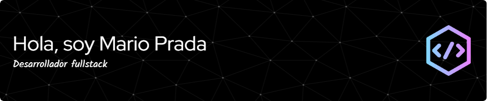

<h1 align="center"><b>Hola, soy Mario Prada </b></h1>

  

<h2> About Me </h2>

- 🔭 Soy Estudiante de DAM
  
- 🌱 Estoy aprendiendo Sql, Java, GitHub, python y Angular
  
- 👯 Me gustaria coolaborar en Proyectos y aprender de profesionales del sector
  
- ⚡ Fun fact: Me gusta el futbol.

<h2> Skills  </h2>

<h2> Connect with me  </h2>
  
 

